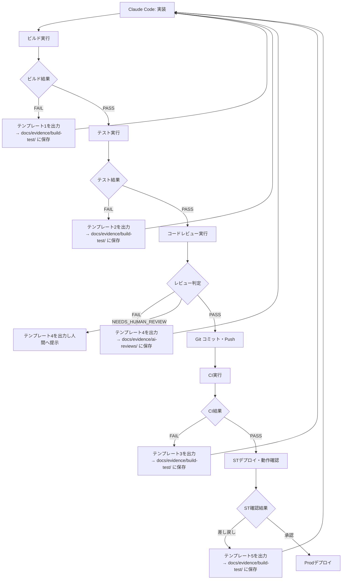

# 製造・テストフェーズ差し戻し報告ワークフロー

このワークフローは `implement-and-verify.md` の FAIL 判定時、および `full-dev-cycle.md` の各フェーズで差し戻しが発生した際の **出力フォーマット** と **成果物の保存先** を定義します。

James Ralph (2026)「Agentic Full-Stack Development」の Evidence Bundle 原則に準拠し、すべての差し戻し報告は証拠に基づく構造化フォーマットで出力します。

## 保存先ルール

| 差し戻し種別 | 保存先 | ファイル名規則 |
| ------------ | ------- | -------------- |
| ビルドエラー | `docs/evidence/build-test/` | `YYYYMMDD-HHmm-build-fail.md` |
| テスト失敗 | `docs/evidence/build-test/` | `YYYYMMDD-HHmm-test-fail.md` |
| CI失敗 | `docs/evidence/build-test/` | `YYYYMMDD-HHmm-ci-fail.md` |
| Lintエラー | `docs/evidence/build-test/` | `YYYYMMDD-HHmm-lint-fail.md` |
| コードレビュー指摘（Major） | `docs/evidence/ai-reviews/` | `YYYYMMDD-HHmm-code-review.md` |
| ST差し戻し | `docs/evidence/build-test/` | `YYYYMMDD-HHmm-st-rework.md` |

**例:**

```text
docs/evidence/build-test/20260307-1430-build-fail.md
docs/evidence/build-test/20260307-1445-test-fail.md
docs/evidence/ai-reviews/20260307-1500-code-review.md
```

---

## テンプレート 1: ビルドエラー報告

`npm run build` の失敗時に出力するフォーマット。
`docs/evidence/build-test/YYYYMMDD-HHmm-build-fail.md` に保存すること。

```markdown
---
date: "YYYY-MM-DD HH:MM"
type: "build-fail"
target: "nextjs"
exit_code: {終了コード}
---

## ビルド失敗レポート — {YYYY-MM-DD HH:MM}

### 判定: FAIL（ビルドエラー）

> {失敗の要因を1-2行で要約する}

### 実行コマンドと終了コード

| コマンド | 終了コード |
| -------- | ---------- |
| `npm run build` | 1 |

### エラーログ抜粋（関連箇所のみ）

```text
{エラーログの関連箇所をここに貼る。全量ではなく原因箇所に絞ること}
```

### 影響ファイル一覧

| ファイルパス | 問題 |
| ------------ | ---- |
| `{ファイルパス}` | コンパイルエラー: 〇〇 |

### 根本原因の特定

{エラーの根本原因を記述する。「症状」ではなく「原因」を書くこと}

### 推奨対応

1. 〇〇を〇〇に修正する（`{ファイルパス}` L{行番号}）
2. 〇〇のインポートを追加する
3. 修正後、`npm run build` を再実行して検証する

### 次アクション

- [ ] 修正して再ビルド → `implement-and-verify.md` Step 2 に戻る
- [ ] 根本原因が不明なため `incident-response` スキルを起動してエスカレーション

```

---

## テンプレート 2: テスト失敗報告

`npm run test` のテスト失敗時に出力するフォーマット。
`docs/evidence/build-test/YYYYMMDD-HHmm-test-fail.md` に保存すること。

```markdown
---
date: "YYYY-MM-DD HH:MM"
type: "test-fail"
total_tests: {テスト総数}
failed_tests: {失敗数}
exit_code: 1
---

## テスト失敗レポート — {YYYY-MM-DD HH:MM}

### 判定: FAIL（テスト失敗）

> {失敗の要因を1-2行で要約する}

### テスト結果サマリー

| 項目 | 件数 |
| ---- | ---- |
| テスト総数 | {N} |
| 成功 | {N} |
| 失敗 | {N} |
| スキップ | {N} |

### 実行コマンドと終了コード

| コマンド | 終了コード |
| -------- | ---------- |
| `npm run test` | 1 |

### 失敗テスト一覧

| テストクラス | テストメソッド | 失敗原因 |
| ------------ | -------------- | -------- |
| `{テストクラス}` | `{テストメソッド}` | `{エラーメッセージ}` |

### エラーログ抜粋（失敗テストのみ）

```text
{失敗テストのスタックトレースを関連箇所のみ貼る}
```

### 根本原因の特定

{テストが失敗している根本原因を記述する。実装バグかテスト自体の問題かを明記すること}

### 推奨対応

1. 〇〇の実装を修正する（`{ファイルパス}` L{行番号}）
2. 修正後、失敗したテストのみ再実行: `npm run test -- <テストファイルパス>`
3. 全テスト通過を確認してから次工程に進む

### 次アクション

- [ ] 実装を修正して再テスト → `implement-and-verify.md` Step 2 に戻る
- [ ] テスト自体が誤っている場合は人間に確認を求める（`NEEDS_HUMAN_REVIEW`）

```

---

## テンプレート 3: CI失敗報告

GitHub Actions のワークフロー失敗時に出力するフォーマット。
`docs/evidence/build-test/YYYYMMDD-HHmm-ci-fail.md` に保存すること。

```markdown
---
date: "YYYY-MM-DD HH:MM"
type: "ci-fail"
pipeline_id: "{パイプラインID}"
failed_stage: "lint | validate | security | quality | e2e"
---

## CI失敗レポート — {YYYY-MM-DD HH:MM}

### 判定: FAIL（CI: {ステージ名}）

> {失敗の要因を1-2行で要約する}

### 失敗ステージ詳細

| ステージ | ジョブ名 | ステータス | 失敗原因 |
| -------- | -------- | ---------- | -------- |
| lint | `check_ai_laziness` | FAILED | 禁止ワード検出 |
| quality | `unit-test` | PASSED | - |

### エラーログ抜粋

```text
{CIログの関連箇所をここに貼る}
```

### 影響ファイル一覧

| ファイルパス | 問題 |
| ------------ | ---- |
| `docs/features/XX.md` | 禁止ワード「〇〇」が含まれている |

### 根本原因の特定

{CI失敗の根本原因を記述する}

### 推奨対応

1. 〇〇を修正する（`{ファイルパス}` L{行番号}）
2. ローカルで事前検証: `{検証コマンド}` を実行
3. 修正をコミット・Push して CI を再実行する

### 次アクション

- [ ] 修正してPush → CI再実行
- [ ] セキュリティ関連の失敗の場合は人間にエスカレーション（`NEEDS_HUMAN_REVIEW`）

```

---

## テンプレート 4: コードレビュー指摘（Major）

Claude Code の自動コードレビューで Major 以上の指摘が発生した場合に出力するフォーマット。
`docs/evidence/ai-reviews/YYYYMMDD-HHmm-code-review.md` に保存すること。

```markdown
---
date: "YYYY-MM-DD HH:MM"
type: "code-review"
verdict: "FAIL | NEEDS_HUMAN_REVIEW"
feature: "{機能名}"
---

## コードレビュー指摘レポート — {YYYY-MM-DD HH:MM}

### 判定: FAIL | NEEDS_HUMAN_REVIEW

> {判定根拠を1行で記述する}

### 指摘一覧

| 指摘ID | 分類 | 重大度 | ファイルパス | 行番号 | 指摘内容 | 推奨修正 |
| ------ | ---- | ------ | ------------ | ------ | -------- | -------- |
| R-001 | セキュリティ | Critical | `{ファイルパス}` | 42 | APIキーがハードコードされている | 環境変数に移動すること |
| R-002 | アーキテクチャ | Major | `{ファイルパス}` | 15 | ビジネスロジックがコンポーネントに混在 | Service層に移動すること |

**重大度の基準:**

- `Critical` — セキュリティ・データ破壊リスク。即時修正必須、次工程進行不可
- `Major` — 設計違反・バグリスク。修正後に再レビュー必須
- `Minor` — 改善推奨。修正任意、次工程進行可（`PASS_WITH_NOTES`）

### 破壊的変更の検出

- [あり/なし] 既存 API シグネチャの変更
- [あり/なし] 既存 DB スキーマの変更
- [あり/なし] 既存 import パスの変更

> [WARN] 破壊的変更がある場合は **必ず `NEEDS_HUMAN_REVIEW`** として人間に提示すること。

### 次アクション

- [ ] Major 指摘を修正 → `implement-and-verify.md` Step 2 に戻る
- [ ] 破壊的変更あり → `NEEDS_HUMAN_REVIEW` として人間に提示して指示待ち
```

---

## テンプレート 5: ステージング（ST）差し戻し

品質ゲート③でST環境の動作確認に問題があった場合に出力するフォーマット。
`docs/evidence/build-test/YYYYMMDD-HHmm-st-rework.md` に保存すること。

```markdown
---
date: "YYYY-MM-DD HH:MM"
type: "st-rework"
environment: "staging"
reported_by: "人間"
---

## ST差し戻しレポート — {YYYY-MM-DD HH:MM}

### 判定: REWORK_REQUIRED（ST差し戻し）

> {問題の要約を1-2行で記述する}

### 確認した問題

| No | 画面/機能 | 問題内容 | 再現手順 | 期待結果 | 実際の結果 |
| -- | --------- | -------- | -------- | -------- | ---------- |
| 1 | チケット一覧画面 | 〇〇が表示されない | 1. ログイン 2. 一覧を開く | 〇〇が表示される | 空白が表示される |

### 影響機能

- `{機能名}` — 〇〇の動作に問題あり
- `{機能名}` — 〇〇との連携で問題発生

### 推奨対応

1. 〇〇の実装を確認する（`{ファイルパス}`）
2. 〇〇のAPI レスポンスを確認する（エンドポイント: `{API パス}`）
3. 修正後、Phase 4（実装）から再実行すること

### 次アクション

- [ ] `full-dev-cycle.md` の Phase 4（実装）に差し戻し
- [ ] 影響範囲が広い場合は設計書の見直しから実施
```

---

## 実行フロー


