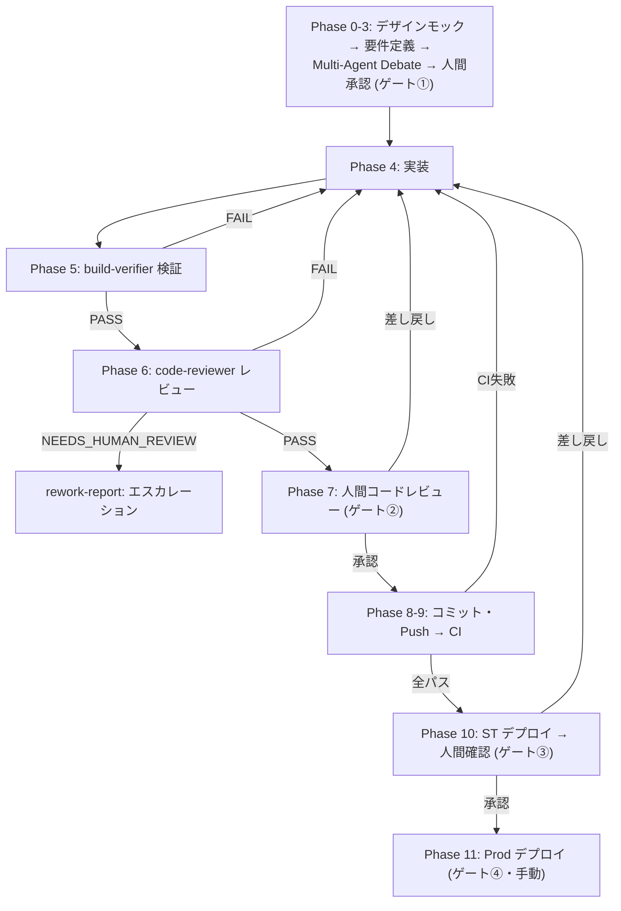

# フル開発サイクル

要件定義からデプロイまでの全工程を一貫して実行するワークフロー。
各フェーズで品質ゲート（人間承認ポイント）を通過してから次に進む。

## フェーズ一覧と品質ゲート

| Phase | 内容 | 担当 | 品質ゲート |
| --- | --- | --- | --- |
| 0 | デザインモック（新規画面のみ） | Claude Code → 人間確認 | [OK] デザイン承認 |
| 1 | 要件整理 | Claude Code | - |
| 2 | 設計書・ADR 作成（Multi-Agent Debate） | Claude Code | - |
| 3 | 人間レビュー | 人間 | [OK] 品質ゲート① |
| 4 | 実装 | Claude Code | - |
| 5 | ビルド＆テスト（build-verifier） | Claude Code | - |
| 6 | コードレビュー（code-reviewer） | Claude Code | - |
| 7 | 人間コードレビュー | 人間 | [OK] 品質ゲート② |
| 8 | Git コミット・Push | Claude Code | - |
| 9 | CI 品質チェック | CI | 自動判定 |
| 10 | ST デプロイ・動作確認 | 自動 → 人間 | [OK] 品質ゲート③ |
| 11 | Prod デプロイ | 人間（手動トリガー） | [OK] 品質ゲート④ |

## ワークフロー全体図

## フェーズ詳細

### Phase 0: デザインモック（新規画面のみ）

新規画面を実装する場合は、実装前に `.claude/workflows/design-mock.md` を実行し、人間のデザイン承認を得る。

### Phase 1-3: 要件定義 → 設計 → 人間承認

`.claude/workflows/requirement-review-loop.md` を実行する。
**品質ゲート①**: 人間が設計書を最終承認してから実装に進む。

### Phase 4-6: 実装 → 検証 → レビュー

`.claude/workflows/implement-and-verify.md` の Step 0〜3 を実行する
（トリアージで COMPLEX 判定なら `deep-plan` → `plan-reviewer` を経てから実装する）。

### Phase 7: 人間コードレビュー

**品質ゲート②**: ユーザーに変更ファイル一覧・概要・破壊的変更の有無を提示して承認を求める。
納品用にテストエビデンスが必要な場合のみ、`bash scripts/collect-test-evidence.sh` の実行を依頼する（任意）。

### Phase 8-9: コミット → CI

人間承認後にコミット・Push する。CI（`.github/workflows/ci.yml`）が自動実行される。
CI 失敗時は原因を修正して Phase 4 に戻る。E2E 起因の失敗は `rework-report` スキルで Evidence Bundle を保存する。

### Phase 10: ST デプロイ → 動作確認

CI 全パス後、ステージング環境へ自動デプロイされる。
**品質ゲート③**: 人間が ST 環境で主要機能を動作確認する。差し戻しは Phase 4 へ（`rework-report` で ST 差し戻しを記録する）。

### Phase 11: Prod デプロイ

**品質ゲート④**: 人間が手動でトリガーするまで実行しない（GitHub Actions の `workflow_dispatch` / Environment 承認ルール）。

## 注意事項

- 破壊的変更を検出したら、どのフェーズでも即座に NEEDS_HUMAN_REVIEW としてエスカレーションする
- CI が全パスするまで Phase 10 に進まない
- ST 動作確認が完了するまで Prod デプロイを実行しない
