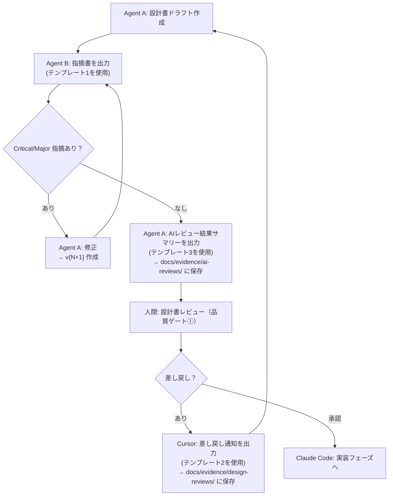

# 設計フェーズ差し戻し出力ワークフロー

このワークフローは `requirement-review-loop.md` の設計ディベートループおよび品質ゲート①における、差し戻し・指摘時の **出力フォーマット** と **成果物の保存先** を定義します。

## 保存先ルール

| 差し戻し種別 | 保存先 | ファイル名規則 |
| ------------ | ------- | -------------- |
| Agent Bの設計指摘 | `docs/evidence/design-reviews/` | `YYYYMMDD-{機能名}-debate-v{N}.md` |
| 人間レビュー差し戻し | `docs/evidence/design-reviews/` | `YYYYMMDD-{機能名}-human-review.md` |
| AIレビュー（設計書） | `docs/evidence/ai-reviews/` | `YYYYMMDD-{機能名}-ai-review.md` |

**例:**

```text
docs/evidence/design-reviews/20260307-ticket-management-debate-v2.md
docs/evidence/design-reviews/20260307-ticket-management-human-review.md
docs/evidence/ai-reviews/20260307-ticket-management-ai-review.md
```

---

## テンプレート 1: Agent B 設計指摘書

`debate-design.mdc` のディベートプロセスにおいて Agent B が指摘を出す際に使用するフォーマット。
このフォーマットで出力した後、`docs/evidence/design-reviews/YYYYMMDD-{機能名}-debate-v{N}.md` に保存すること。

```markdown
---
date: "YYYY-MM-DD"
feature: "{機能名}"
target_doc: "{対象設計書のパス}"
debate_round: {N}
reviewer: "Agent B (QA/Security)"
---

## Agent B レビュー結果 — {設計書名} v{N}

### 判定: FAIL | PASS_WITH_NOTES

> 判定根拠を1行で記述する。

### 指摘一覧

| 指摘ID | 分類 | 重大度 | 該当箇所 | 指摘内容 | 修正要求 |
| ------ | ---- | ------ | -------- | -------- | -------- |
| B-001 | 矛盾 | Major | `## 認証フロー` L12 | 要件定義では〇〇だが、設計書では〇〇になっている | Agent Aは〇〇に修正すること |
| B-002 | エッジケース | Major | `## エラー処理` | 〇〇が空の場合の挙動が未定義 | 空入力時のレスポンスを明記すること |
| B-003 | セキュリティ | Critical | `## APIエンドポイント` | 〇〇エンドポイントに認証チェックが記載されていない | JWTトークン検証の実装方針を明記すること |

**重大度の基準:**

- `Critical` — セキュリティ脆弱性・データ破壊リスク。次工程進行不可
- `Major` — 要件矛盾・エッジケース漏れ。修正後に再レビュー必須
- `Minor` — 表現の曖昧さ・補足推奨。修正任意、次工程進行可

### Agent A への修正依頼

上記の指摘を踏まえ、以下の修正を行い v{N+1} ドラフトを提出してください:

1. （指摘B-001に対応）〇〇を〇〇に変更する
2. （指摘B-002に対応）〇〇セクションに空入力時の処理を追記する
3. （指摘B-003に対応）認証フローに〇〇を追加する
```

---

## テンプレート 2: 人間レビュー差し戻し通知

品質ゲート①（人間が設計書を最終承認）において差し戻しが発生した場合に、Cursorが人間の指示を受けて出力するフォーマット。
このフォーマットで出力した後、`docs/evidence/design-reviews/YYYYMMDD-{機能名}-human-review.md` に保存すること。

```markdown
---
date: "YYYY-MM-DD"
feature: "{機能名}"
target_doc: "{対象設計書のパス}"
reviewer: "人間"
status: "REWORK_REQUIRED"
---

## 人間レビュー差し戻し — {YYYY-MM-DD}

### 差し戻し対象

`{設計書のパス}` （v{N}）

### 差し戻し理由

- 〇〇の仕様が要件定義書 `docs/features/XX.md` と整合していない
- 〇〇のユースケースが不足している
- 〇〇のセキュリティ要件が `docs/guides/security.md` の基準を満たしていない

### 修正依頼事項

1. 〇〇セクションを〇〇の観点で修正すること
2. 〇〇ユースケース（ログアウト済みユーザーのアクセス等）を追記すること
3. 〇〇の非機能要件に具体的な数値（タイムアウト値、同時接続数等）を記載すること

### Cursorへの指示

上記の修正依頼を `requirement-review-loop.md` の Step 2（ディベートループ）から再実行してください。
修正完了後、再度 `docs/evidence/design-reviews/YYYYMMDD-{機能名}-debate-v{N+1}.md` を出力し、人間レビューに提出してください。
```

---

## テンプレート 3: 設計書 AI レビュー結果サマリー

Agent A がディベート完了後の設計書を自己レビューした結果を記録するフォーマット。
`docs/evidence/ai-reviews/YYYYMMDD-{機能名}-ai-review.md` に保存すること。

```markdown
---
date: "YYYY-MM-DD"
feature: "{機能名}"
target_doc: "{対象設計書のパス}"
reviewer: "Agent A (Self-review after debate)"
debate_rounds: {N}
---

## 設計書 AI レビュー結果 — {機能名}

### 判定: PASS | PASS_WITH_NOTES

### ディベートサマリー

| ラウンド | Agent B 指摘数 | Critical | Major | Minor | 解決済み |
| -------- | -------------- | -------- | ----- | ----- | -------- |
| v1 → v2 | 3 | 1 | 2 | 0 | 3/3 |
| v2 → v3 | 1 | 0 | 1 | 0 | 1/1 |

### 残存課題（PASS_WITH_NOTES の場合のみ記載）

- （Minor指摘で次工程には影響しないが、実装フェーズで注意すべき事項があれば記載）

### 整合性チェック

- [OK/NG] `docs/agentic/mvp_requirements.md` との整合性
- [OK/NG] `docs/api/spec-api.md` への反映状況
- [OK/NG] `docs/design/spec-db.md` への反映状況
- [OK/NG] 禁止ワード（タスクリスト系語句）不使用
- [OK/NG] YAMLフロントマター（title, project, version, date, author）あり

### 次工程への申し送り

Claude Code（実装担当）への特記事項:

- 〇〇の実装には〇〇に注意すること
- 〇〇は〇〇ライブラリを使用せず、〇〇で実装すること
```

---

## 実行フロー


