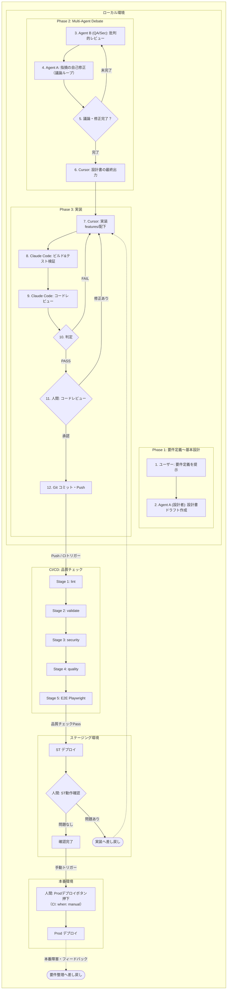

# フル開発サイクル

要件定義からデプロイまでの全工程を一貫して実行するワークフロー。
各フェーズで品質ゲート（人間承認ポイント）を通過してから次に進みます。

## ワークフロー全体図



## フェーズ概要

```text
Phase 0: デザインモック    → /design-mock ワークフローを使用（新画面のみ）
Phase 1: 要件整理          → Cursor が作成
Phase 2: 設計書・ADR作成   → Cursor が作成
Phase 3: 人間レビュー      → 人間が承認（品質ゲート①）
Phase 4: 実装              → Claude Code が実装
Phase 5: ビルド＆テスト    → Claude Code が検証
Phase 6: コードレビュー    → Claude Code がレビュー
Phase 7: 人間コードレビュー → 人間が確認（品質ゲート②）
Phase 8: Git コミット      → Claude Code が実行
Phase 9: CI 品質チェック   → CI が自動実行
Phase 10: ST デプロイ      → 自動 → 人間がST動作確認（品質ゲート③）
Phase 11: Prod デプロイ    → 人間が手動トリガー（品質ゲート④）
```

## ワークフロー詳細

### Phase 0: デザインモック（新規画面のみ）

新規画面を実装する場合は、実装前に必ずデザインモックを作成・承認する。

1. `/design-mock` ワークフロー（`.cursor/workflows/design-mock.md`）を実行
2. `docs/design/mockups/{画面名}-dark.html` / `{画面名}-light.html` を作成
3. `docs/design/spec-design-system.md` のカラートークンに準拠していることを確認
4. 人間がブラウザで動作確認・デザイン承認
5. `docs/design/mockups/README.md` のファイル一覧を更新

> [WARN] **モックファイルはプロジェクトルートに置かない**。必ず `docs/design/mockups/` に保存する。

**品質ゲート①'**: 人間がデザインモックを承認してから要件定義に進む

---

### Phase 1-3: 要件定義→ディベート（`/requirement-review-loop` を使用）

`.cursor/workflows/requirement-review-loop.md` のディベートワークフローを実行する。

**品質ゲート①**: 人間が要件定義を最終承認

### Phase 4: 実装（Claude Code）

1. 承認済み仕様書（`docs/features/*.md`）を読み込む
2. `CLAUDE.md` のアーキテクチャに従って実装
3. フロントエンド: `features/<機能名>/` 配下
4. バックエンド: レイヤー構成に従う
5. 新規 API → `docs/api/spec-api.md` を同時更新
6. DB 変更 → `docs/design/spec-db.md` を同時更新

### Phase 5-6: ビルド→テスト→レビュー（`/implement-and-verify` の Step 2-4 を使用）

`.cursor/workflows/implement-and-verify.md` の Step 2〜4 を実行する。

### Phase 7: 人間コードレビュー

**品質ゲート②**: ユーザーに以下を提示して承認を求める：

- 変更ファイルの一覧と概要
- 破壊的変更の有無

テストエビデンスを保存：

```bash
bash scripts/collect-test-evidence.sh
```

### Phase 8: Git コミット

人間承認後、GitコミットとPushを実行。

### Phase 9: CI 品質チェック（CI — 自動）

`.github/workflows/ci.yml` に定義されたワークフローが自動実行される（代表ジョブ）：

1. **lint** — Markdownlint、Prettier、ESLint
2. **validate** — プレースホルダー検知、ドキュメント構造・リンク
3. **test** — Vitest、Next.js プロダクションビルド
4. **security** — gitleaks、ハードコード検知
5. **e2e** — Playwright（`e2e/` がある場合）
6. **deploy** — staging（main push）、production（`workflow_dispatch`）

CI 失敗時は Phase 4 に戻る。

### Phase 10: ST デプロイ → 動作確認

CI 全パス後、ステージング環境へ自動デプロイされる。

**品質ゲート③**: 人間が ST 環境で動作確認

1. ST 環境へ自動デプロイ（GitHub Environment `staging`）
2. 人間が ST 環境で主要機能を動作確認
3. 問題があれば Phase 4 に差し戻し
4. 問題なければ Phase 11 へ

### Phase 11: Prod デプロイ

**品質ゲート④**: 人間が手動で本番デプロイをトリガーするまで実行しない。

GitHub では **Actions の `workflow_dispatch`**（または Environment の承認ルール）で本番のみ人間が明示的に起動する。

```yaml
# .github/workflows/ci.yml の deploy-production ジョブ（概要）
# on.workflow_dispatch により手動実行のみ
deploy-production:
  if: github.event_name == 'workflow_dispatch' && github.ref == 'refs/heads/main'
  environment: production
```

## 各フェーズの担当者マトリクス

| Phase                     | 担当                 | 品質ゲート      |
| ------------------------- | -------------------- | --------------- |
| 0. デザインモック         | Cursor / 人間確認    | [OK] デザイン承認 |
| 1. 要件整理               | Cursor               | -               |
| 2. 設計書・ADR作成        | Cursor               | -               |
| 3. 人間レビュー           | 人間                 | [OK] 品質ゲート①  |
| 4. 実装                   | Claude Code          | -               |
| 5. ビルド＆テスト         | Claude Code          | -               |
| 6. コードレビュー         | Claude Code          | -               |
| 7. 人間コードレビュー     | 人間                 | [OK] 品質ゲート②  |
| 8. Git コミット           | Claude Code          | -               |
| 9. CI 品質チェック        | CI                   | 自動判定        |
| 10. ST デプロイ・動作確認 | 自動→人間            | [OK] 品質ゲート③  |
| 11. Prod デプロイ         | 人間（手動トリガー） | [OK] 品質ゲート④  |

## 注意事項

- 破壊的変更がある場合は即座に `NEEDS_HUMAN_REVIEW` にエスカレーション
- CI が全パスするまで Phase 10 に進まないこと
- ST 動作確認が完了するまで Prod デプロイボタンを押さないこと
