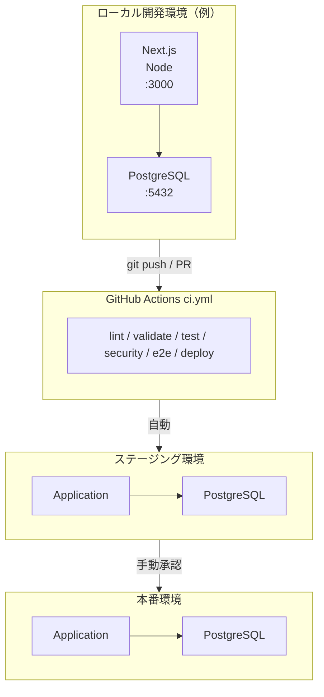

# Growth Mile インフラ構成図（ドラフト）

**最終更新**: 2026-05-11
**対象**: MVP 開発・ST・本番環境

---

## 1. 環境構成

---

## 2. ローカル開発環境

### Docker Compose（DB のみの例）

プロジェクトルートの [`docker-compose.yml`](../../docker-compose.yml) は PostgreSQL をローカル起動する用途が中心です。アプリはホスト上で `npm run dev` を実行する想定です。

| サービス | イメージ例 | ポート | 役割 |
|---------|-----------|--------|------|
| `db` | `postgres:16-alpine` | 5432 | PostgreSQL |

詳細なマルチサービス構成はインフラ確定後に `spec-infrastructure.md` を更新してください。

---

## 3. CI/CD パイプライン

### GitHub Actions（`.github/workflows/ci.yml`）

| グループ | ジョブ（代表） | 内容 |
|---------|----------------|------|
| lint | `lint-markdown`, `format-check`, `lint-nextjs` | Markdown / Prettier / ESLint |
| validate | `check-ai-laziness`, `check-links`, `check-doc-structure`, `generate-diagrams` | ドキュメント・プレースホルダー検証 |
| test | `unit-test`, `build-nextjs` | Vitest、Next.js ビルド |
| security | `secrets-scan`, `hardcoded-credentials` | Gitleaks、パターン検知 |
| e2e | `e2e-playwright` | Playwright（`e2e/package.json` がある場合） |
| deploy | `deploy-staging`, `deploy-production` | スタブ（インフラ確定後に実装） |

### Secrets（GitHub Actions）

| 名前 | 用途 |
|------|------|
| `CI_DB_USER` | E2E 用 DB ユーザー |
| `CI_DB_PASSWORD` | E2E 用 DB パスワード |
| `CI_DB_NAME` | E2E 用 DB 名 |
| `CI_NEXTAUTH_SECRET` | NextAuth 署名鍵（32 文字以上） |

環境 URL は GitHub **Environments** の Environment URL、または Variables で管理することを推奨します。

---

## 4. 本番環境（想定）

> [WARN] インフラ未確定。以下は推奨構成。

| コンポーネント | 推奨構成 | 代替案 |
|--------------|---------|--------|
| フロントエンド | Vercel / Netlify | Nginx on VPS |
| バックエンド | AWS ECS / GCP Cloud Run | Docker on VPS |
| データベース | AWS RDS / GCP Cloud SQL | PostgreSQL on VPS |
| リバースプロキシ | CloudFlare / ALB | Nginx |
| SSL証明書 | Let's Encrypt / CloudFlare | AWS ACM |

---

## 5. セキュリティ構成

| レイヤー | 対策 |
|---------|------|
| ネットワーク | HTTPS強制、CORS制限 |
| アプリケーション | JWT認証、BCryptハッシュ |
| データベース | パラメータバインディング、接続暗号化 |
| CI/CD | Gitleaks、CodeQL（オプション） |
| 運用 | GitHub Secrets / Environments で秘密情報を管理 |
