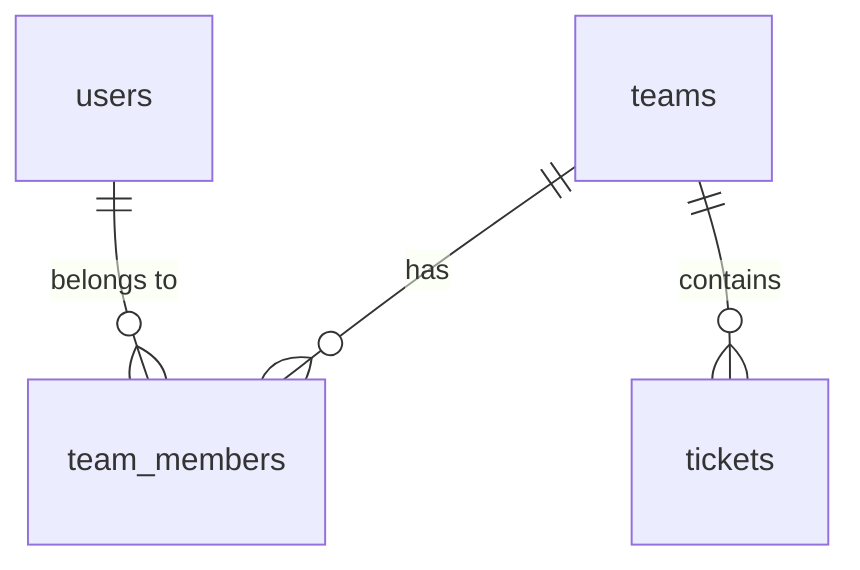

<!-- markdownlint-disable -->

# データベース設計書

## 更新履歴

| 日付 | バージョン | 変更内容 | 担当者 |
|------|-----------|---------|--------|
| YYYY-MM-DD | 1.0 | 初版作成 | - |

## 1. 概要

システム概要を1-2段落で記述する。対象RDBMS、文字コード、照合順序などの基本方針も記載する。

| 項目 | 内容 |
|------|------|
| RDBMS | PostgreSQL 15 |
| 文字コード | UTF-8 |
| スキーマ | public |

## 2. テーブル一覧

| # | テーブル名 | 用途 | レコード見込み |
|---|-----------|------|--------------|
| 1 | `users` | ユーザー管理 | 〜100件 |
| 2 | `teams` | チーム管理 | 〜10件 |

## 3. テーブル定義

### 3.1 `users` テーブル

ユーザー情報を管理する。

| カラム名 | 型 | 制約 | デフォルト | 説明 |
|---------|------|------|----------|------|
| `id` | UUID | PK | `gen_random_uuid()` | ユーザーID |
| `email` | VARCHAR(255) | NOT NULL, UNIQUE | - | メールアドレス |
| `password_hash` | VARCHAR(255) | NOT NULL | - | ハッシュ化パスワード |
| `username` | VARCHAR(100) | NOT NULL | - | 表示名 |
| `created_at` | TIMESTAMP | NOT NULL | `NOW()` | 作成日時 |

**インデックス**

| インデックス名 | カラム | 種類 | 目的 |
|---------------|--------|------|------|
| `idx_users_email` | `email` | UNIQUE | メールアドレス検索・ログイン |

**制約・備考**

- `password_hash` は BCrypt を使用（コスト12）
- `email` は小文字で正規化して格納

## 4. Enum 定義

| Enum名 | 値 | 説明 |
|--------|-----|------|
| `TeamRole` | `ADMIN` | チーム管理者 |
| `TeamRole` | `MEMBER` | 一般メンバー |
| `TicketStatus` | `UNASSIGNED` | 未割当 |
| `TicketStatus` | `ASSIGNED` | 担当者割当済み |
| `TicketStatus` | `RESOLVED` | 解決済み |
| `TicketPriority` | `LOW` | 低 |
| `TicketPriority` | `MEDIUM` | 中 |
| `TicketPriority` | `HIGH` | 高 |
| `TicketPriority` | `URGENT` | 緊急 |

## 5. リレーション

### 外部キー一覧

| 子テーブル | 子カラム | 親テーブル | 親カラム | ON DELETE |
|-----------|---------|-----------|---------|-----------|
| `team_members` | `user_id` | `users` | `id` | CASCADE |
| `team_members` | `team_id` | `teams` | `id` | CASCADE |
| `tickets` | `team_id` | `teams` | `id` | CASCADE |
| `tickets` | `creator_id` | `users` | `id` | RESTRICT |

## 6. ER図

<!-- Mermaid図はPDF変換時にPNG画像に自動変換されます -->

## 7. マイグレーション方針

| 環境 | 方式 | 説明 |
|------|------|------|
| 開発 (dev) | `ddl-auto: update` | Hibernate自動DDL |
| 本番 (prod) | `ddl-auto: validate` | Flyway/手動SQL |

## 8. データ保全・バックアップ

| 項目 | 内容 |
|------|------|
| バックアップ頻度 | 日次 |
| 保持期間 | 30日 |
| バックアップ方式 | pg_dump |
